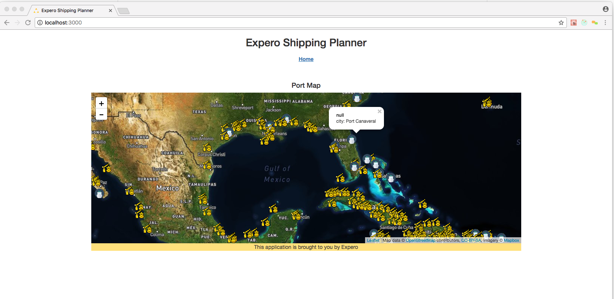
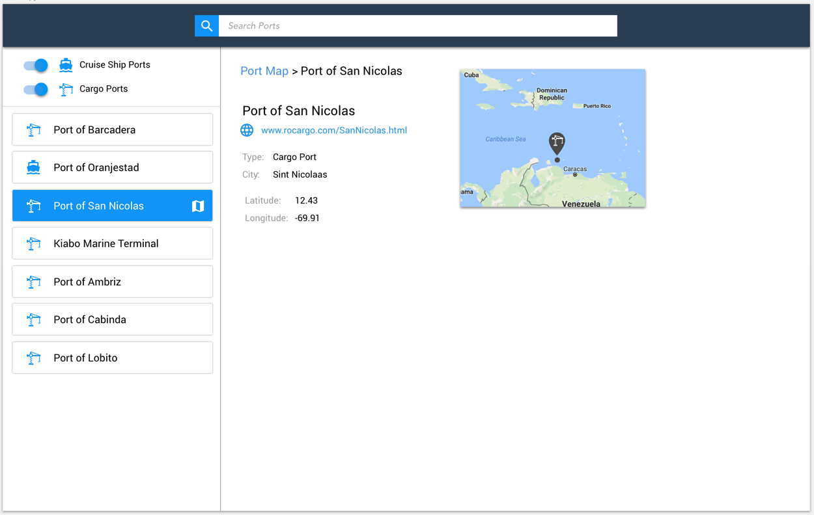

## Getting Started

1. Install NodeJS (12.x or newer)
2. Install Yarn Package Manager
3. From this directory run: ```yarn```. This will download all of the npm dependencies
4. Try ```yarn start``` and make sure you do not see any errors
5. Once the web server is running, visit [http://localhost:3000](http://localhost:3000). You should see a map.

## Important Code Locations

* src/ - contains the code for the client-side app
* server/ - contains the code for the development web server
* server/api.js - contains the REST API endpoint(s)

It is very unlikely you will need to look at anything outside of these locations.

## Development Workflow

To speed things up, we have provided some boilerplate setup for two common global state management options: React Context API and Redux. You are free to use either or use something else entirely. To start the development web server and use the React Context API, run ```yarn start:context```. This will initialize the app to use the Context API for state management. Otherwise, to use Redux for state management, run ```yarn start:redux```. This will initialize the app to use the Redux state provider. Finally, to initialize the app without Redux or React Context API, run ```yarn start```. Either of these commands will automatically compile and bundle all of the client JavaScript, SCSS, HTML.

They will serve the app at http://localhost:3000 and proxy a local NodeJS server at http://localhost:5000.

The commands automatically monitor the ```src``` and ```server``` folders for changes. Anytime you change a file, it will automatically recompile and re-bundle the client and/or server. Your browser will automatically load the new code and update itself.

If you need to adjust the logic that initializes the App with either no state management vs Context API or Redux, this can be found in the `src/App.js` file. 

## Note

This repo uses [Create React App (CRA)](https://reactjs.org/docs/create-a-new-react-app.html). 

# Your Challenge

The bare bones React app renders a single "Home" page showing a map that uses leaflet.js. (Note the Counter route has been left as an example but is not actually used):


The repo has the following libraries loaded. We encourage you to make use of them, or any others you feel you need:

* React
* Redux (see the ```src/store``` folder)
* React Router
* Leaflet (for the map rendering)

Implement our new front end design on top of this barebones starter. An API is already available for retrieving port data with some options for filtering, which you may not need to change at all.

We are looking for a working prototype of the design implemented in React. It doesn't need to match the design pixel for pixel and we don't have icons from UX yet, so fill the gaps where you need to.

## Design

### Main Screen


### Detail View


## Requirements

1. Map Style
   * Keep the existing dark satellite style (ignore the light blue style shown in the design wireframes).
2. Ignore the "Search" feature in the design wireframes.
3. Add the left panel that lists the harbors shown in the map.
4. Adjust the layout so that the map completely fills the right side of the page as shown in the wireframes.
5. The two toggles on the left panel should filter the data so that it does not show on the map or in the list.
6. Clicking on a harbor in the list should show the popup on the map for that harbor.
7. Clicking on a harbor on the map should highlight it in the list.
8. Clicking on the "details" icon in the list, or clicking "View details" in the popup should show the Detail View.
9. The map on the Details view should only show the single harbor location.
10. Within the Main Screen, set a port of your choice as the Default Port and persist this value. 
11. In the View Detail screen display a UI element of your choice (such as an icon) if the current port is the Default Port. 
